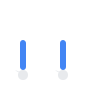
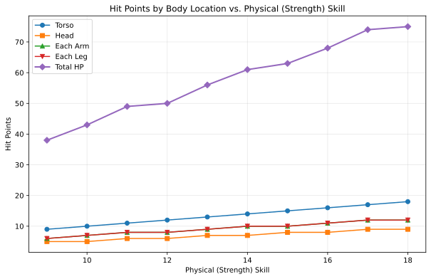

# 6. Combat

Combat situations arise naturally in many genres and settings. OpenAxiom recognizes that violence is sometimes necessary in fiction, and that in fact it is often a key aspect of why people enjoy TTRPGs, and so provides mechanics that make these scenes engaging and meaningful, providing enough simulationist crunch to add consistent and serious consequences and interesting tactical choices.

At the same time, OpenAxiom recognizes that combat may not be the goal of some tables. As a result, the combat system is designed to be optional, not strictly necessary to character progression or development. Game Masters **may choose to avoid the combat rules entirely if they wish!** These are designed for tables that *like* combat. If your table wants to focus on narrative, it can simply focus on the core [character mechanics](character_mechanics.md) and [logic of action](logic_of_action.md) rules, using Contested Actions or Contested Extended Actions to simulate combat when needed. This is why the health and body locations system is specified *here*, and not in the character mechanics section.

When characters enter combat, the game shifts to the Tactical Time round structure as defined in the [core game loop](core_game_loop.org). This shift to Tactical Time is mandatory during combat encounters, ensuring that all actions occur in a consistent and fair sequence. During Tactical Time, each character takes turns performing actions, with initiative determined by relevant skills and traits. This system allows for detailed resolution of combat actions while maintaining the pace and excitement of violent confrontation.

## 6.1. The Attack Sequence

When characters enter combat, the game shifts to the Tactical Time round structure as defined in the [core game loop](core_game_loop.md). The full sequence of play during a round in combat is defined there, including how initiative is determined and how players take turns performing actions. This section describes only the sequence of steps required to perform the "Attack" Major Action under Tactical Time. Remember that attacking is just one of many possible Major Actions you can take during your turn in combat.

All weapons have a required skill level that must be met or exceeded to use them effectively. The action point cost to make an attack with a weapon is the standard 6 AP for a Major Action plus the additional cost based on skill difference. This additional cost is determined by subtracting the character's skill level from the weapon's required skill level, with a minimum additional cost of 0 AP. For example, if a character has a **Combat (Melee) (Sword)** skill of 12 and the sword requires a skill level of 10, the attack would cost 6 AP (6 + 10 - 12 = 6 + -2, minimum 0 = 6). If the character's skill is significantly lower than the weapon's requirement, the attack costs more AP. For instance, if the character has a skill of 8 and the weapon requires 10, the attack would cost 8 AP (6 + 10 - 8 = 8).

For rules on how many weapons a character can wield and how to change wielded weapons, see the [Wielding Weapons](#wielding-weapons) section.

The sequence of steps required to do the "Attack" Major Action under Tactical Time follows this sequence:

1. **Declare**: The attacker declares their attack, specifying their target, the location they are aiming for, and the weapon or type of attack they are using. Players cannot attack with weapons that are not currently wielded.

2. **Calculate Cost**: The action point cost of the attack is calculated (6 AP base + weapon's required skill - character's skill, minimum 0 additional cost).

3. **Roll**: The attacker makes their **Combat** skill check. The defender makes a relevant defense check (e.g., **Physical (Dodge)**).

4. **Determine**: The outcome is determined by comparing the Degrees of Success. The attack hits if the attacker achieves a higher degree of success.

5. **Damage**: On a hit, the attacker rolls their weapon's damage.

6. **Armor**: The target subtracts the Damage Resistance (DR) value of the armor covering the specific location hit from the total damage.

7. **Apply**: The final damage is subtracted from the HP of the location that was hit.

> It was Kaelen's turn. He lunged at the pirate in front of him, combat knife a silver blur.
>
> 1. **Declare:** "I'm attacking the pirate with my knife, aiming for his Torso!"
>
> 2. **Calculate Cost:** His skill of 13 easily met the knife's requirement of 9, so the attack cost the standard 6 AP.
>
> 3. **Roll:** Kaelen rolled a 7 against his target of 13—an Exceptional Success. The pirate rolled a 9 against his Dodge of 10—a Standard Success.
>
> 4. **Determine:** Kaelen's higher degree of success meant a clean hit.
>
> 5. **Damage:** His knife deals 1d6 damage; he rolled a 5.
>
> 6. **Armor:** The pirate's armored clothing had a DR of 2, reducing the damage to 3.
>
> 7. **Apply:** The GM narrated, "Your blade slips past his guard, and he grunts as it sinks into his side, dealing 3 points of damage to his Torso."

## 6.2. Wielding Weapons

Characters may only wield a number of weapons equal to their number of non-crippled arms. For most characters, this means they can wield up to two weapons (one in each hand). If a character has a crippled arm, they can only wield one weapon. If both arms are crippled, they cannot wield any weapons.

Weapons must be claimed to be wielded prior to the beginning of tactical time. Changing which weapons are being wielded requires a Major Action during tactical time. A character cannot attack with a weapon that is not currently wielded.

Each attack with a weapon costs a Major Action, as described in the Attack Sequence section.

## 6.3. Beyond Attacks: Other Combat Actions

While the attack sequence focuses on making attacks, combat encounters often involve much more than just hitting opponents. Players can use their Major Actions during combat to perform a wide variety of activities that make sense in the situation.

Examples of other combat actions include:

- Shoving an opponent to push them backward or knock them prone

- Hiding behind cover or ducking behind an obstacle

- Attempting to disarm an opponent's weapon

- Climbing onto a ledge or structure for tactical advantage

- Binding a wound during a lull in the fighting

- Shouting commands to allies or intimidating enemies

- Searching a fallen opponent for items

- Activating a special ability or item

When a player wants to perform an action that isn't covered by the standard attack sequence, they simply describe what they want to do and ask the Game Master. The Game Master will determine what type of skill check is appropriate based on the situation:

- Simple Action: For straightforward tasks that don't require opposition

- Contested Action: For actions that directly oppose another character's efforts

- Extended Action: For tasks that require time and sustained effort

- Contested Extended Action: For ongoing struggles between characters

This approach provides much less to remember than traditional move lists while maintaining the simulational crunch players enjoy. It also allows for greater creativity and flexibility in combat situations, as players aren't limited to a predefined set of actions.

## 6.4. The Injury System

The injury system determines *what actually happens* when a character takes damage. It represents different body parts separately, with different mechanical effects as a result of attacking them, to provide more interesting mechanical choices.

### 6.4.1. Health & Body Locations

Characters have six body locations, each with its own pool of Hit Points (HP). HP is calculated from the character's **Physical (Strength)**, **Physical (Endurance)**, **Constitution**, or other skill values, whichever is highest. The difficulty modifier applies to the attacker's combat skill value when targeting that specific location.

| Body Location | Hit Points Calculation | Example (Strength 9) | Difficulty Modifier |
|--------|--------|--------|--------|
| Torso | Full **Physical (Strength)** value | 9 HP | +0 |
| Head | 1/2 **Physical (Strength)** (round up) | 5 HP | -3 |
| Each Arm | 2/3 **Physical (Strength)** (round up) | 6 HP | -2 |
| Each Leg | 2/3 **Physical (Strength)** (round up) | 6 HP | -2 |

The following table provides a quick reference for the HP values of each body location for characters with **Physical (Strength)** skills ranging from 9 to 18. This is purely for convenience; the actual rule is still the calculation in the body part table above.

| Physical (Strength) | Torso | Head | Each Arm | Each Leg | Total HP |
|--------|--------|--------|--------|--------|--------|
| 9 | 9 | 5 | 6 | 6 | 38 |
| 10 | 10 | 5 | 7 | 7 | 43 |
| 11 | 11 | 6 | 8 | 8 | 49 |
| 12 | 12 | 6 | 8 | 8 | 50 |
| 13 | 13 | 7 | 9 | 9 | 56 |
| 14 | 14 | 7 | 10 | 10 | 61 |
| 15 | 15 | 8 | 10 | 10 | 63 |
| 16 | 16 | 8 | 11 | 11 | 68 |
| 17 | 17 | 9 | 12 | 12 | 74 |
| 18 | 18 | 9 | 12 | 12 | 75 |

The following graph visualizes how a character's total HP and HP per body part increase as their **Physical (Strength)** skill improves:

### 6.4.2. Consequences of Injury

Damage to local HP pools does not immediately do anything. However, over time, as injuries to various parts of the body add up, global effects begin to take place.

#### 6.4.2.1. Crippling Injury

When a location's HP is reduced to **0 or below**, it is Crippled. This has the following effects:

| Body Location | Effect on Character |
|--------|--------|
| General | When a location is first Crippled, the character's **Physical** Harm Tracker immediately increases by one level. |
| Head | In addition to the **Physical** Harm, the character's **Mental** Harm Tracker also increases by one level. The character must make an immediate **Physical (Endurance)** check or fall unconscious. |
| Arm (First Crippled) | The character loses access to half of their total inventory slots, rounded up. The player must immediately choose which items to drop. |
| Arm (Second Crippled) | The character's available inventory slots are reduced to 0 |
| Leg (First Crippled) | The character's movement speed is halved. |
| Leg (Second Crippled) | The character's movement speed is reduced to a minimum of 1. |

A limb may go into the negative HP levels as well. This does not make the crippling worse, but it can have other consequences, as described in the Systemic Shock section.

#### 6.4.2.2. Critical Success on Attack

When an attacker scores a Critical Success, they deal damage as normal. In addition, the target's **Physical** Harm Tracker immediately increases by one level. This is independent of and can stack with Harm gained from a Crippling Injury on the same attack.

#### 6.4.2.3. Systemic Shock

Systemic shock occurs whenever a character's total HP pool is decreased by another half of their total original HP pool. The character's **Physical** Harm Tracker increases by one level for every half of their total original HP pool that they lose.

For example, a character with average **Physical (Strength)** of 9 would have a total of 38 HP across all locations (9 Torso + 5 Head + 6 Left Arm + 6 Right Arm + 6 Left Leg + 6 Right Leg). This character would experience systemic shock and gain one level on their **Physical** Harm Tracker for every 19 HP they lose from their original total:

- At 38-20 HP remaining (0-18 HP lost): No systemic shock

- At 19-1 HP remaining (19-37 HP lost): First systemic shock (+1 to **Physical** Harm Tracker)

- At 0 HP remaining (38+ HP lost): Second systemic shock (+2 to **Physical** Harm Tracker)

#### 6.4.2.4. Defeat and Death

A character is taken out of a fight under the following conditions:

- **Incapacitated**: Their **Physical** Harm Tracker reaches Level 4.

- **Unconscious**: Their Head or Torso is Crippled, and they fail the subsequent **Physical (Endurance)** check.

- **Killed**: Their Head or Torso HP is reduced to a negative value equal to its starting maximum (e.g., -5 HP for a 5 HP Head).

In the former two cases, staying alive becomes an Extended Action against their **Physical (Strength)** skill that lasts as many turns as the tactical combat scene, instead of a set number of turns. While/if they succeed, they get to continue being only unconscious until the combat scene ends. If they fail, they die.

> The pirate, with a Strength of 10, had only 3 HP left on his Torso. Kaelen's 3-damage strike was devastating. "That hit reduces his Torso HP to 0," the GM announced. "That location is now **Crippled**. His **Physical** Harm Tracker increases to Level 1, giving him a -1 penalty to all physical actions. He also needs to make an Endurance check to stay conscious." The pirate passed the check, grimacing in pain but remaining on his feet. The pirate had lost 18 HP total in the fight, just shy of the 21.5 needed to trigger Systemic Shock. For now, he was merely wounded, not yet in shock.
>

#### 6.4.2.5. Non-Harm-Tracker Status Effects

While the harm tracker system covers generalized status effects that affect broad categories of skills, some specific status effects operate outside this system. These non-harm-tracker-based status effects are simpler and more focused in their mechanical impact. There are three primary types:

1. **Continuous HP Drain**: Effects like bleeding or poison that continuously drain HP from a specific body location. Unlike harm trackers which apply penalties to skill checks, these effects directly reduce the HP pool of the affected limb. For example, a bleeding arm would lose a set amount of HP each round until the bleeding is stopped. Note that all normal effects of HP loss still apply to continuous HP drain, including systemic shock when total HP loss reaches certain thresholds and checks for whether the limb becomes crippled when its HP reaches 0 or below.

2. **Movement Speed Detriment**: Effects that reduce a character's movement speed, such as being entangled or slowed. These effects set a specific detriment to the character's normal movement allowance, reducing how many hexes they can move on their turn.

3. **Weapon Range Detriment**: Effects that reduce the effective range of a character's weapons, such as poor visibility or unstable footing. These effects set a specific detriment to the weapon's normal range, reducing the distance at which the weapon remains effective.

These status effects represent specific, concrete mechanical impacts rather than the generalized skill penalties of harm trackers, providing more precise simulation of certain conditions that affect characters in combat.
