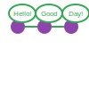

# 8. Social Relations

OpenAxiom recognizes that social interactions and factional relations are often just as crucial to roleplaying narratives as combat. Thus, it tries to provide a structured system for tracking how characters relate to each other and to various factions for tables that want serious mechanical consequences and tactical choice and resource management for their social interactions as much as their violent ones. **Like the** [combat rules,](combat.md) **this system is completely optional**: the core [logic of action](logic_of_action.md) rules should be more than enough to resolve social actions and consequences for tables that *don't* desire extra depth.

## 8.1. Faction Identification

Factions provide context for social interactions by helping to determine how different characters might react to each other. For example, a character from a military faction might have automatic tensions with someone from a rebel faction, while two characters from the same guild might have an easier time building rapport.

Characters in OpenAxiom belong to one faction each, which represents their primary affiliation, organization, culture, or other group with shared interests. Every character, whether player character, NPC, or enemy, is associated with such a faction. This could be as broad as a nation or as specific as a secret society.

Player characters establish their primary faction during character creation. See the Character Creation chapter for details on how to select an appropriate faction for your character and the initial reputation that comes with it.

## 8.2. Reputation With Factions

A character's reputation with a faction represents how a specific character is viewed by members of that faction. This system allows for complex social dynamics where individual actions can affect how others perceive you, regardless of your own faction affiliation.

### 8.2.1. Reputation Tracking

Each character maintains a reputation score from -5 to 5 with every faction they've encountered. This is tracked on the character sheet as follows:

- When first meeting a character from a new faction, a new reputation line is created, with a default value determined by the rules in the Default Reputation section.

- Reputation ranges from **-5** (completely despised) to **5** (universally admired), with **0** representing a neutral standing

Reputation is tracked separately for each faction encountered, meaning a character could be highly respected by one faction (score of 3-5) and poorly regarded by another (score of -5 to -3).

### 8.2.2. Default Reputation: Faction Relationships

Factions have relationships with each other that exist independently of individual characters. These relationships provide a baseline for how members of different factions interact by defining a character's default starting reputation.

There are three basic relationship states between factions:

- **Friendly**: Factions that generally get along, cooperate, or share common goals

- **Neutral**: Factions that have no particular feelings toward each other

- **Hostile**: Factions that are actively opposed to each other

These relationships are established by the Game Master as part of the campaign's world-building and can shift over time based on events in the game.

When player characters encounter a new faction for the first time, their initial reputation with that faction is determined by the relationship between that faction and any factions the character has already encountered. This is determined by the following rules, in descending order of precedence:

1. **Friendly Relationship**: If the new faction is *friendly* to any faction the character has a reputation with already, the character starts with a reputation score **the same** as the *lowest* reputation score they have with a faction that the new one is friendly to. For example, say your character has a +4 reputation with the Empire and a -2 reputation with the Smugglers' Guild. You encounter the Trade Federation, which is Friendly to both the Empire and the Guild. Because the rule uses your lowest reputation among friendly factions, your starting reputation with the Trade Federation is -2.

2. **Hostile Relationship**: If the new faction is *hostile* to any faction the character has a reputation with already, the character starts with a reputation score of **0 minus** the *highest* reputation score they have with a faction that the new one is hostile to (in other words, the negative version of that reputation score). For example, if you meet the Rebel faction, and you have a reputation of 4 with the Empire, and a reputation of -2 with the Trade Federation, then your reputation with the Rebels will be -4, since your highest reputation with a faction hostile to the Rebels is 4, not -2, and 0 - 4 is -4.

3. **Neutral Relationship**: If the new faction is neutral toward every faction the character has already built a reputation with, the character starts with **the default reputation score of 0.**

The Game Master should determine the relationships between factions during campaign preparation and note them for reference during play.

> Jax, with his +4 Street Runner reputation, met with a representative of the Dockworkers' Union for the first time. The GM had established that the Union was Friendly to the Runners. The GM explained, "The Union foreman sizes you up. He's heard good things about the Runners and knows you're one of them. Following the rule for friendly factions, your starting reputation with the Dockworkers' Union is the same as your reputation with the Street Runners. You start at +4."
>

### 8.2.3. Changing Reputation

Reputation with a faction can change whenever a character interacts with members of that faction through social skill checks (usually **Social** or **Social (…)**):

| Degree of Success on Social Skill Check | Reputation Change With Faction |
|--------|--------|
| Critical Success | +3 (capped at 5) |
| Exceptional Success | +1 |
| Standard Success | No change |
| Marginal Failure | No change |
| Exceptional Failure | -1 |
| Critical Failure | -3 (minimum of -5) |

These changes only apply when the social interaction is with a member of the faction whose reputation is being affected. For example, impressing a military officer would improve your reputation with the military faction, but not with a merchant guild.

The Game Master determines when a social interaction is significant enough to affect reputation. Minor interactions like asking for directions typically don't affect reputation, while major negotiations, public speeches, or acts of heroism/villainy would.

### 8.2.4. Reputation Effects

A character's reputation with a faction affects social interactions with members of that faction:

| Reputation Range | Modifier |
|--------|--------|
| High Reputation (3-5) | +1 bonus to social skill checks |
| Neutral Reputation (-2 to 2) | No modifier |
| Poor Reputation (-5 to -3) | -1 penalty to social skill checks |

These modifiers are applied to the target number when making social skill checks against members of that faction.

### 8.2.5. Spending Reputation for Advantage

Characters can treat their reputation with various factions as social capital, spending it to gain advantages in critical moments. When a character spends reputation, they reduce their reputation score with that faction by a certain amount to gain a benefit. Spending reputation in this way represents the character calling in favors, using their status, or leveraging their influence to achieve specific goals.

Characters can spend reputation in one of three ways:

1. **Additional Bonus on Faction-Related Skill Checks**: Spend 1 point of reputation with a faction to add an additional +1 bonus to any **Social** skill check with that faction. This bonus stacks with the existing reputation modifier.

2. **Reroll a Critical Failure**: Spend 1 reputation point with a faction to reroll any critical failure made in a **Social** skill check with that faction. The character must accept the result of the second roll, even if it is worse.

3. **Vouch for a Friend**: Spend 1 reputation point with a faction to vouch for a friend's character with that faction. This temporarily grants the friend the character's (pre-spend) reputation score with that faction for the course of one scene, if it is higher than the friend's own. The friend's reputation with the faction returns to its normal value at the end of the scene.

After spending reputation, the character's reputation score with that faction is reduced by the amount spent.

> Jax needed the Union foreman to "lose" a valuable shipping container, a very risky ask. His reputation with the Union stood at a solid +4. To improve his odds, Jax's player said, "This is a crucial roll. I'm going to spend 1 point of my reputation to call in a favor." The GM updated the character sheet. "Okay, your reputation with the Union is now +3. For this one check, you'll get a +1 bonus for your high reputation, plus an additional +1 for spending the point. You get a total of +2 to your social check."
>

### 8.2.6. Reputation Actions

Players can take specific actions that directly affect their reputation with factions. The reputation changes from these actions are in addition to any changes from social skill checks during interactions with faction members. Each type of action has a specific reputation bonus or penalty:

| Action | Reputation Change | Description |
|--------|--------|--------|
| Betrayal | -3 | Characters who betray a faction's trust suffer a significant reputation penalty. Betrayal includes actions like revealing faction secrets, sabotaging faction operations, or directly working against the faction's interests. |
| Salvation | +3 | Characters who save a faction or its members from significant harm gain a substantial reputation bonus. Salvation includes actions like rescuing faction leaders, defending faction territory from attackers, or preventing disasters that would harm the faction. |
| Missions/Quests | +2 | Characters who complete missions or quests for a faction gain a reputation bonus. These are tasks performed for the faction without direct payment, showing dedication to the faction's goals. |
| Jobs | +1 | Characters who complete paid jobs for a faction gain a smaller reputation bonus. While jobs show the character is trustworthy and competent, they are primarily business transactions rather than acts of dedication. |
| Failing Missions/Quests | -2 | Characters who fail to complete missions or quests for a faction suffer a reputation penalty. This reflects the faction's disappointment in the character's inability to fulfill their commitments. |
| Failing Jobs | -1 | Characters who fail to complete paid jobs for a faction suffer a reputation penalty. While less severe than failing an unpaid mission, failing a job still damages trust. |
| Ignoring or Going Back on Jobs | -2 | Characters who ignore or go back on agreed-upon jobs without completing them suffer a reputation penalty. This is as severe as failing a mission because it shows the character cannot be trusted to honor their agreements. |

## 8.3. Using Social Relations in Play

The social relations system is designed to add depth to roleplaying encounters without slowing down gameplay. Here's how to incorporate it into your game:

### 8.3.1. Tracking First Encounters

When player characters meet NPCs or enemies from factions they haven't encountered before, the Game Master should note this and create a new reputation entry starting at 0. This can be done quickly during play and doesn't need to interrupt the flow of the game.

### 8.3.2. Social Skill Checks

When a player attempts a social skill check against an NPC, the Game Master should consider whether the interaction is significant enough to affect reputation. As a general rule:

- Routine interactions (asking for directions, ordering food) don't affect reputation

- Extended interactions (negotiations, lengthy conversations) might affect reputation

- Pivotal interactions (alliance negotiations, public speeches, acts of heroism or villainy) always affect reputation

After resolving a social skill check that affects reputation, the Game Master should adjust the appropriate reputation score and note any mechanical effects for future interactions.

## 8.4. Social Combat

Characters can engage in social combat, attempting to damage another character's reputation with a specific faction through slander, propaganda, or other means of social manipulation. This represents the cut and thrust of social maneuvering where characters try to undermine each other's standing in a community.

Social combat is a simple gloss on the Contested Action rules found in [the Action chapter](logic_of_action.md), following the following steps:

1. **Initiation**:

      - Any character can initiate social combat against another character they know has a reputation with a faction.

      - The initiating character must declare the target character, and the reputation with which faction they are targeting.

      - The target character must already have an established reputation with that faction.

2. **Resolution**:

      - Social combat is resolved as a Contested Action between the initiating character and the target character. Each participant uses any relevant social skill (such as **Social (Diplomacy)**, **Social (Deception)**, or **Social (Performance)**).

      - **The modifier for each participant's skill check is determined by their own reputation with the faction being targeted.**

      - If the initiating character lacks a reputation with the targeted faction, they use the default score of 0 for their check.

3. **Outcomes**:

      - If the initiating character fails the contested action, they lose one point of reputation with the targeted faction as their attempts to slander another are seen as desperate or unseemly.

      - If the initiating character succeeds, the target character loses one point of reputation with the targeted faction as their standing has been successfully undermined.

> Jax's rival, Silk, decided to undermine his standing with the Dockworkers' Union. She initiated social combat, starting a whisper campaign. This resolved as a Contested Action. Silk used her **Social (Deception)** of 12, while Jax defended with his **Social (Diplomacy)** of 10. His +3 reputation with the Union gave him a +1 bonus, for a target of 11. Silk rolled an 8 (Standard Success), while Jax rolled a 12 (Marginal Failure). The GM delivered the outcome: "Silk, your rumors are subtle but effective. Jax, you fail to counter them. Your reputation with the Dockworkers' Union drops by one point, from +3 to +2."
>
